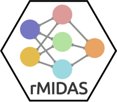

# rMIDAS 

<!-- badges: start -->

[](https://cran.r-project.org/package=rMIDAS/)
[](https://lifecycle.r-lib.org/articles/stages.html)
[](https://github.com/MIDASverse/rMIDAS/commits/master/)
[](https://github.com/MIDASverse/rMIDAS/actions/)
<!-- badges: end -->

## Overview

**rMIDAS** is an R package for accurate and efficient multiple imputation using deep learning methods. The package provides a simplified workflow for imputing and then analyzing data:

-   `convert()` carries out all necessary preprocessing steps
-   `train()` constructs and trains a MIDAS imputation model
-   `complete()` generates multiple completed datasets from the trained
    model
-   `combine()` runs regression analysis across the complete data,
    following Rubin’s combination rules

**rMIDAS** is based on the Python package
[MIDASpy](https://github.com/MIDASverse/MIDASpy).

### Efficient handling of large data

rMIDAS also incorporates several features to streamline and improve the
the efficiency of multiple imputation analysis:

-   Optimisation for large datasets using `data.table` and `mltools`
    packages
-   Automatic reversing of all pre-processing steps prior to analysis
-   Built-in regression function based on `glm` (applying Rubin’s
    combination rules)

### Background and suggested citations

For more information on MIDAS, the method underlying the software, see:

Lall, Ranjit, and Thomas Robinson. 2022. "The MIDAS Touch: Accurate and Scalable Missing-Data Imputation with Deep Learning." _Political Analysis_ 30, no. 2: 179-196. [Published version](https://ranjitlall.github.io/assets/pdf/Lall%20and%20Robinson%202022%20PA.pdf). [Accepted version](http://eprints.lse.ac.uk/108170/1/Lall_Robinson_PA_Forthcoming.pdf).

Lall, Ranjit, and Thomas Robinson. 2023. "Efficient Multiple Imputation for Diverse Data in Python and R: MIDASpy and rMIDAS." _Journal of Statistical Software_. [Accepted version](https://ranjitlall.github.io/assets/pdf/jss4379.pdf) (in press).


## Installation

rMIDAS is now available on
[CRAN](https://cran.r-project.org/package=rMIDAS). To install the
package in R, you can use the following code:

``` r
install.packages("rMIDAS")
```

To install the latest development version, use the following code:

``` r
# install.packages("devtools")
devtools::install_github("MIDASverse/rMIDAS")
```

Note that rMIDAS uses the
[reticulate](https://github.com/rstudio/reticulate) package to interface
with Python. Users must have Python 3.7 or 3.8 installed in order to run
MIDAS (3.9 is currently untested), as well as the following
dependencies:

-   matplotlib
-   numpy
-   pandas
-   scikit-learn
-   tensorflow
-   tensorflow-addons (for TF2)

rMIDAS will automatically try to set up a Python configuration unless
users specify their own version using `set_python_env()` (examples
below). Setting a custom Python install must be performed *before*
training or imputing data occurs:

``` r
library(rMIDAS)

# Point to a Python binary
set_python_env(x = "path/to/python/binary")

# Or point to a virtualenv binary
set_python_env(x = "virtual_env", type = "virtualenv")

# Or point to a condaenv, where conda can be supplied to choose a specific executable
set_python_env(x = "conda_env", type = "condaenv", conda = "auto")

# Now run rMIDAS::train() and rMIDAS::complete()...
```

You can also download the
[`rmidas-env.yml`](https://github.com/MIDASverse/rMIDAS/blob/master/rmidas-env.yml)
conda environment file from this repository to set up all dependencies
in a new condaenv. To do so, download the .yml file, navigate to the
download directory in your console and run:

``` bash
conda env create -f rmidas-env.yml
```

Then, prior to training a MIDAS model, make sure to load this
environment in R:

``` r
set_python_env(x = "rmidas-env", type = "conda")
```

## Vignettes (including simple example)

**rMIDAS** is packaged with two vignettes:

1.  [`vignette("imputation_demo", "rMIDAS")`](https://github.com/MIDASverse/rMIDAS/blob/master/vignettes/imputation_demo.Rmd)
    demonstrates the basic workflow and capacities of **rMIDAS**
2.  [`vignette("custom_python_versions", "rMIDAS")`](https://github.com/MIDASverse/rMIDAS/blob/master/vignettes/custom_python_versions.Rmd)
    provides detailed guidance on configuring Python binaries and
    environments, including some troubleshooting tips

## Contributing to rMIDAS

Interested in contributing to **rMIDAS**? We are looking to hire a
research assistant to work part-time (flexibly) to help us build out new
features and integrate our software with existing machine learning
pipelines. You would be paid the standard research assistant rate at the
University of Oxford. To apply, please send your CV (or a summary
of relevant skills/experience) to <ranjit.lall@sjc.ox.ac.uk>.

## Getting help

rMIDAS is still in development, and we may not have caught all bugs. If
you come across any difficulties, or have any suggestions for
improvements, please raise an issue
[here](https://github.com/MIDASverse/MIDASpy/issues).
